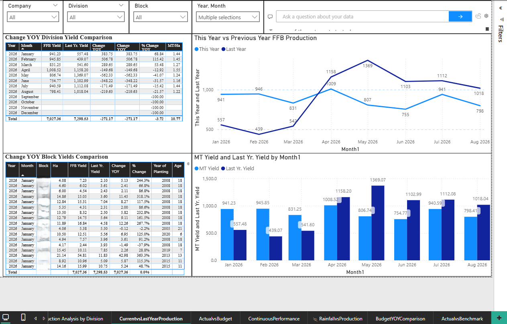
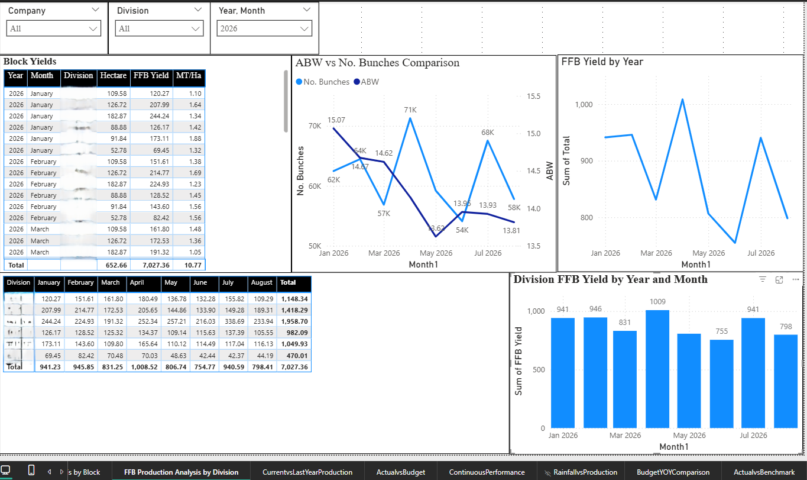
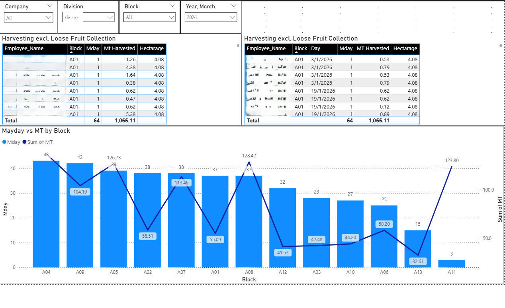
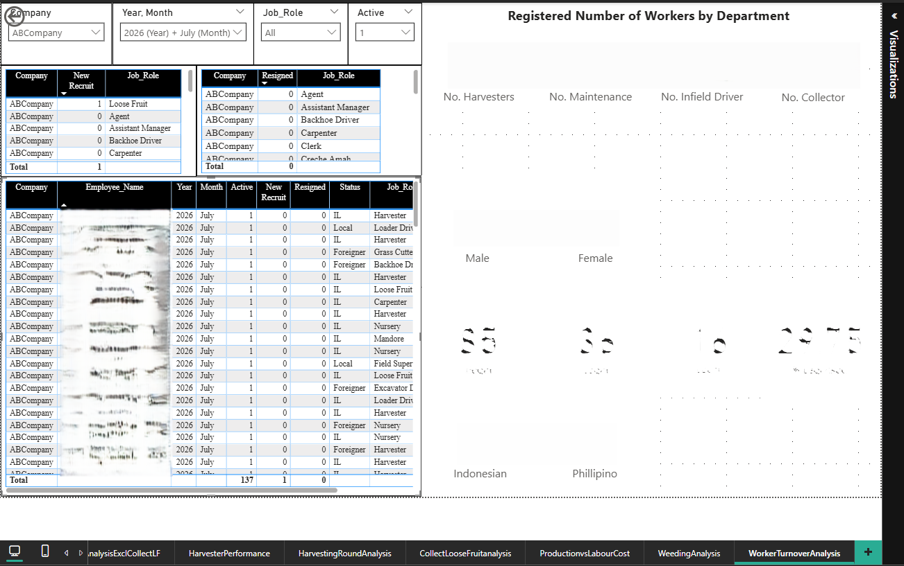
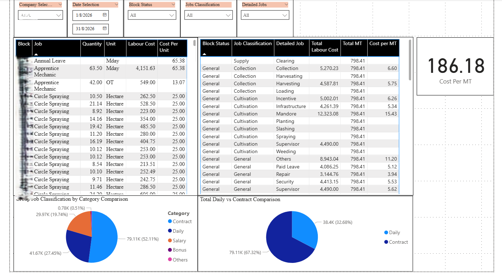
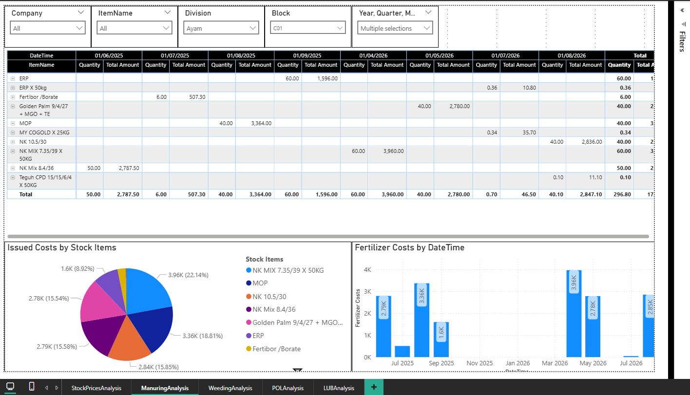
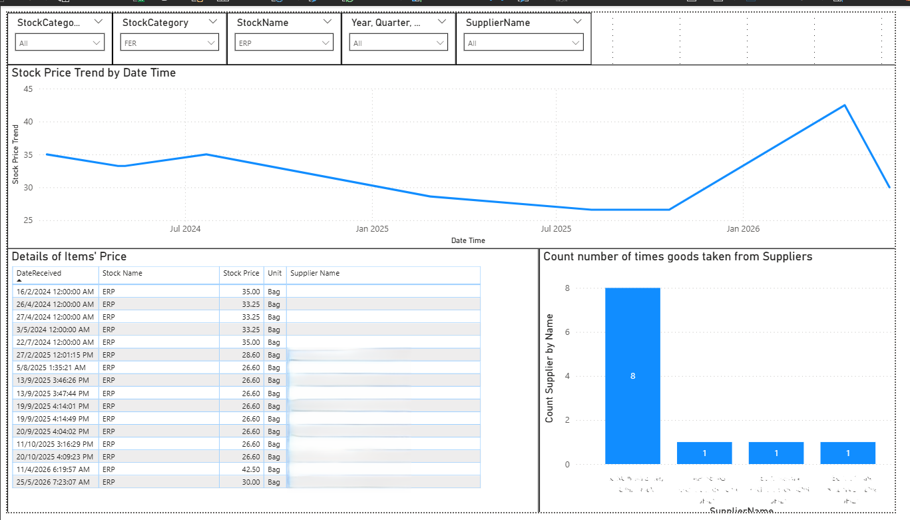

# Plantation Operations Analytics — Power BI Dashboards

A collection of interactive Power BI dashboards built to support decision-making
in a palm oil plantation operation. These dashboards cover **FFB production
analysis**, **payroll and harvesting performance**, and **stock/supplier
analytics** — and are used to answer the operational questions that management,
finance, and procurement teams ask every week.

## Why this project exists

Managing a plantation generates a lot of data — daily FFB yield, block-level
harvesting, worker attendance, payroll costs, stock movement, supplier
pricing. But data alone doesn't help; **the questions behind the data do**:

- Which divisions are underperforming this year vs last year?
- What is our true cost per metric ton of FFB, and what drives it?
- Are we over-relying on a small number of suppliers?
- Which blocks or workers are producing above or below target?
- Where is our fertilizer and chemical spend actually going?

Each dashboard was designed around a specific question. The visuals come
*after* the question, not before.

---

## Dashboard 1 — FFB Production Analysis

**Business question:** How is FFB yield trending this year vs last year, and
where are the gaps by division and block?

**What it shows:**
- **YoY comparison** — line chart of monthly FFB production, current year vs
  prior year
- **Division-level yield ranking** — table of every division's performance
  with variance % vs last year
- **Block-level yield comparison** — the same comparison at block granularity,
  so management can identify underperforming blocks
- **MT yield vs last year by month** — side-by-side bars for quick comparison
- **Interactive slicers** — filter by Company, Division, Block, and Year/Month

**What a manager can do with it:**
- Spot which divisions are trending down and need intervention
- Compare block-level yield within a division to identify best practice
- Track whether last month's production is above or below the same month last year

**Screenshot:**

---

## Dashboard 2 — Payroll & Harvesting Performance

**Business question:** What is our real cost per metric ton of FFB, and how do
different job categories, worker types, and blocks contribute to it?

**What it shows:**
- **Cost per MT KPI** — the headline metric, updated with slicer context
- **Job classification by category** — quantity, labour cost, and total cost
  for every job type (mechanic, harvesting, fertilizing, etc.)
- **Cost per MT by job** — reveals which activities are the most expensive
  per unit of production
- **Daily vs Contract breakdown** — where labour cost actually sits
- **Category split** — Daily / Salary / Bonus / Others as a proportion of
  total cost
- **Block-level harvesting yield** — MT harvested per block vs hectarage,
  so yield-per-hectare can be compared across blocks
- **Demographic breakdown** — Male/Female, local vs foreign workers
- **Interactive slicers** — Company, Date range, Block, Job

**What a manager can do with it:**
- Identify which job categories drive cost the most, per MT
- Compare block productivity to spot inconsistent harvesting
- Track labour cost trends across months and worker types
- Make staffing decisions based on the cost-per-MT impact

**Screenshot:**

---

## Dashboard 3 — Stock, Cost & Supplier Analytics

**Business question:** What stock are we consuming, when, and who are we
buying it from — and are we over-reliant on any single supplier?

**What it shows:**
- **Stock issued by month** — itemized table (Fertilizer, Chemicals, etc.)
  with quantity and total amount per month
- **Cost breakdown by stock item** — donut chart of where spend concentrates
- **Fertilizer costs by date/time** — trend of fertilizer spend across months
- **Stock price trend over time** — tracking price movement for any item
- **Details of items received** — supplier, price, unit, quantity, and date
- **Supplier concentration analysis** — how many times each supplier has
  delivered, so over-reliance is visible at a glance
- **Interactive slicers** — Stock Category, Stock Name, Year/Quarter, Supplier

**What a manager can do with it:**
- See where the biggest stock spend categories are
- Track price trends to time purchases better
- Identify suppliers we depend on and diversify where needed
- Compare stock consumption patterns month-to-month

**Screenshot:**

---

## How to view these dashboards

- **Static preview:** Screenshots above show the key views of each dashboard.
- **Interactive version:** Available on request — will be published here when ready.
- **Source files:** The `.pbix` files are available on request — they contain
  proprietary data and are not published publicly.

## Technical notes

**Built with:**
- Microsoft Power BI Desktop
- Power Query (M) for data transformation
- DAX for calculated measures (YoY comparisons, cost per MT, running totals)
- Data model relationships between transactional tables and dimension tables
  (Company / Division / Block / Job / Stock / Supplier)

**Design principles used:**
- One dashboard = one decision. Each dashboard is built around a specific
  operational question.
- Slicers for exploration. Users can filter by the dimensions that matter to
  their role (division manager vs HQ analyst vs procurement).
- Consistent visual language. Blue/teal palette, matching typography, aligned
  KPI panels.
- Business-readable labels. Column names, measures, and chart titles use the
  vocabulary of the business — not internal field names.
- Data model first, visuals second. Every dashboard has a clean star-schema-style
  model underneath; no visual is driven by ad-hoc joins.

---

## Note on data and screenshots

All screenshots in this repository use **anonymized or placeholder data**.
No real company financials, worker names, or supplier contracts are published.
The dashboards themselves are demonstrated in sanitized form for portfolio
purposes.

---

## What I'd build next

- **Mobile-optimized layout** for field managers who check numbers on phones
- **Row-level security** so each division manager sees only their division
- **Incremental refresh** so the model stays fast as historical data grows
- **Automated refresh + email subscriptions** for weekly production reports
- **Anomaly flags** — automatic highlighting when a block's yield drops more
  than X% below its rolling average

---

## About

Built by **Chin Kee Ming** — a Power BI analyst and Python developer with
30 years of financial and plantation accounting experience. I build analytics
and automation tools that business teams actually use, because I understand
the questions behind the data.

🔗 [LinkedIn](https://www.linkedin.com/in/chin-kee-ming-588685148)
💻 [GitHub](https://github.com/chinkm/Power-BI-Projects)

